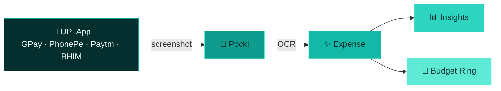

<div align="center">


<br/>

### **Version 1.0** · Premium personal finance for iPhone

Snap a UPI payment from **any app**. Drop it into Pocki. Watch your spending come alive.

<br/>

[](https://developer.apple.com/ios/)
[](https://swift.org)
[](#-tech--design)
[](#-tech--design)
[](LICENSE)
[](https://github.com/amritkang165/Pocki/stargazers)

<br/>


</div>

---

<div align="center">

## ✨ The Idea

</div>

You already screenshot every UPI payment.

**Pocki** turns those screenshots into a beautiful money story —

not locked to Google Pay. **Any UPI app.** PhonePe · Paytm · BHIM · GPay · Amazon Pay · and more.

<div align="center">

<br/>


<br/>

> **v1 ships manual tracking.**  
> Screenshot OCR is the north star — and the data model is already ready for it.

</div>

---

<div align="center">

## 🎯 Version 1 vs What’s Next

</div>

<table>
<tr>
<td width="50%" valign="top">

### ✅ Ships in v1
<br/>

| | |
|:--|:--|
| 🏠 | Home dashboard with budget ring |
| 💸 | Full expense ledger + search |
| ➕ | Fast add sheet + haptics |
| 📊 | Apple Charts insights |
| ⚙️ | Budget · currency · reset |
| 🌙 | Dark Mode · Dynamic Type |

</td>
<td width="50%" valign="top">

### 🚀 Coming next
<br/>

| | |
|:--|:--|
| 📸 | **Any UPI screenshot upload** |
| 🔍 | On-device OCR (amount · merchant · date) |
| 🧠 | Smart category suggestions |
| 📤 | CSV / PDF export |
| 🧩 | Widgets · Live Activities |
| ☁️ | CloudKit sync · multi-wallet |

</td>
</tr>
</table>



---

<div align="center">

## 💎 Features that feel first-party

</div>

### 🏠 Home — *How am I doing this month?*

<p align="center">
  
  
  
  
</p>

Large typography. Soft glass cards. A progress ring that actually makes you care.

### 💸 Expenses — *Your full story*

<p align="center">
  
  
  
  
</p>

### ➕ Add Expense — *Bottom sheet bliss*

Amount auto-focused · merchant · category picker · date · notes · big Save · success haptic.

### 📊 Insights — *Charts that breathe*

Weekly bars · monthly area · category donut · top merchants · week-over-week trend — all **Apple Charts**.

### ⚙️ Settings — *Quiet control*

Monthly budget · currency · export placeholder · reset all data · about.

---

<div align="center">

## 🎨 Tech & Design

</div>

```text
   SwiftUI  ·  SwiftData  ·  MVVM  ·  Apple Charts
   NavigationStack  ·  SF Symbols  ·  Swift 6  ·  iOS 26+
```

| Design cue | Pocki choice |
| :---: | :--- |
| 🎨 | Calm **teal** palette (`#0F9B8E`) — never purple spam |
| 🔤 | Large **rounded** type · Apple-first hierarchy |
| 🫧 | Glass cards · soft shadows · 16–24pt radii |
| ✨ | Ring animations · sheet motion · list springs · haptics |
| 🌙 | Full Dark Mode · Dynamic Type · accessibility |

Inspired by **Wallet · Journal · Fitness · Health** — not Material Design.

### Architecture

```text
Pocki/
├── Models/         Expense · Category · Source · Settings
├── ViewModels/     Home · Expenses · Insights · Settings
├── Views/          Tabs + sheets
├── Components/     BudgetCard · ProgressRing · GlassCard · …
├── Services/       Expense · Budget · Haptics · Export
├── Extensions/     Date · Currency · Theme
└── Utilities/      Constants · Mock · Previews
```

Future-ready on every expense:

`source` · `isVerified` · `confidence` → built for **UPI screenshot OCR**.

---

<div align="center">

## 🛠 Run locally

</div>

```bash
git clone https://github.com/amritkang165/Pocki.git
cd Pocki
open Pocki.xcodeproj
```

1. Select an **iPhone** simulator  
2. Set **Signing Team** for a physical device  
3. Press **⌘R**

**Needs:** Xcode 26+ · iOS 26 simulator/device

---

<div align="center">

## 🔒 Privacy

</div>

- Everything stays **on-device** with SwiftData  
- No accounts · no backend · no tracking in v1  
- Screenshot OCR will prefer **local** processing  

---

<div align="center">

## 🏷 Categories

<br/>

`Food` · `Shopping` · `Travel` · `Bills` · `Entertainment`  
`Health` · `Education` · `Groceries` · `Subscriptions` · `Other`

</div>

---

<div align="center">

## 📄 License

**MIT** © 2026 [Amrit Kang](https://github.com/amritkang165)  
See [LICENSE](LICENSE)

<br/>

---

<br/>

### Built for people who already screenshot every payment.

**Pocki v1** — track manually today.  
**Any UPI app** — screenshot magic tomorrow.

<br/>

<a href="https://github.com/amritkang165/Pocki">
  
</a>

<br/><br/>

<sub>Designed to feel like Apple made it · Made with ♥ in India 🇮🇳</sub>

</div>
