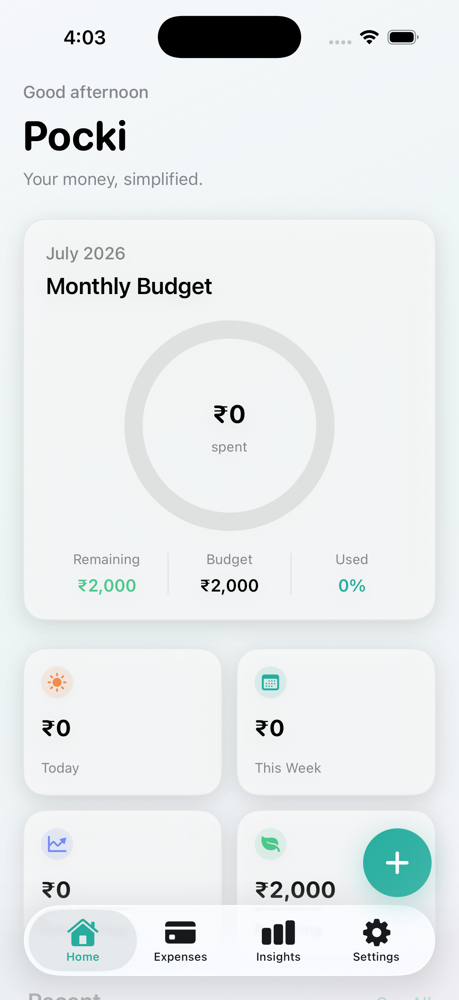

<div align="center">

```text
 ██████╗  ██████╗  ██████╗██╗  ██╗██╗
 ██╔══██╗██╔═══██╗██╔════╝██║ ██╔╝██║
 ██████╔╝██║   ██║██║     █████╔╝ ██║
 ██╔═══╝ ██║   ██║██║     ██╔═██╗ ██║
 ██║     ╚██████╔╝╚██████╗██║  ██╗██║
 ╚═╝      ╚═════╝  ╚═════╝╚═╝  ╚═╝╚═╝
```

### Your money, simplified.

**v1.0** · Premium iOS finance · Built for UPI India

[](https://developer.apple.com/ios/)
[](https://swift.org)
[](#-stack)
[](LICENSE)
[](https://github.com/amritkang165/Pocki)



**[Full documentation →](docs/DOCUMENTATION.md)**

```text
 ╭──────────────────────────────────────────────────────╮
 │                                                      │
 │   ★  WHAT MAKES POCKI DIFFERENT                      │
 │                                                      │
 │   You already screenshot every UPI payment.          │
 │   Pocki turns that screenshot into an expense.       │
 │                                                      │
 │   Not one wallet. ANY UPI APP.                       │
 │   GPay · PhonePe · Paytm · BHIM · Amazon Pay · …     │
 │                                                      │
 ╰──────────────────────────────────────────────────────╯
```

</div>

---

## The unique loop

```text
     ┌─────────────┐      ┌─────────────┐      ┌─────────────┐
     │  Pay with   │      │  Screenshot │      │   Pocki     │
     │  any UPI    │ ───▶ │  (you already│ ───▶ │  reads it   │
     │  app        │      │   do this)  │      │             │
     └─────────────┘      └─────────────┘      └──────┬──────┘
                                                      │
                      ┌───────────────────────────────┘
                      ▼
     ┌─────────────────────────────────────────────────┐
     │  amount  +  merchant  +  date  →  insights      │
     │  budget ring · categories · trends              │
     └─────────────────────────────────────────────────┘
```


<details>
<summary><b>▶ Why this beats typing everything</b></summary>

<br/>

| Old expense apps | **Pocki** |
| :--- | :--- |
| Open app → type amount → type merchant → pick date | Drop the UPI screenshot you already took |
| Tied to one bank / one wallet — or nothing | Built for **every** UPI app |
| Easy to skip ₹49 chai spends | Capture happens at payment time |
| Feels like homework | Feels native · calm · Apple-like |

```text
  typing forever ……………  ✗
  screenshot → done ………  ✓  ← this is the product
```

</details>

---

## Status

```text
  [████████████████████░░░░]  v1.0 shipped
  [████████░░░░░░░░░░░░░░░░]  v1.1 UPI screenshot OCR  ← in app now
```

| Version | What to add |
| :---: | :--- |
| **v1.0** ✅ | Manual tracking · budget ring · insights · settings |
| **v1.1** ◐ | **Any UPI screenshot** → on-device OCR → confirm → save *(live in Add Expense)* |
| **v1.2** | Smart categories · filters · duplicate warnings |
| **v1.3** | CSV / PDF export · Share Extension |
| **v2.0** | Widgets · Live Activities · optional budget alerts |
| **v2.1** | CloudKit sync · multi-wallet · recurring expenses |

Full breakdown → **[docs/DOCUMENTATION.md §19](docs/DOCUMENTATION.md#19-roadmap--future-architecture)**

---

## See it work

```text
  ╭──────────────────────────────╮          ╭──────────────────────────────────╮
  │ UPI · GPay          ● Success │          │ Add Expense · prefilled by OCR     │
  │                              │          │                                    │
  │ Paid to                      │          │ From UPI screenshot         ✓      │
  │   Chai Point                 │          │                                    │
  │ UPI ID · 9912xxxx@upi        │          │ Amount     ₹ 250.00                │
  │                              │          │ Merchant   Chai Point              │
  │           ₹ 250.00           │          │ Category   Food & Drink            │
  │        12 Aug · 2:14 PM      │          │ Date       Today · 2:14 PM         │
  │                              │          │ Confidence 92%                     │
  │       ✓ Payment successful   │          │                                    │
  ╰──────────────────────────────╯          │         [ Review & Save ]          │
          ╰──────────────────────────────────╯

                 └──────────────────────────────────────▲
                 OCR · on device
```

Screenshot → prefilled form → **you** review → save. Nothing is saved until you confirm.

---

## Works with

```text
  ┌──────────┐  ┌──────────┐  ┌──────────┐  ┌──────────┐  ┌──────────────┐
  │   GPay   │  │ PhonePe  │  │  Paytm   │  │   BHIM   │  │  Any UPI ✦   │
  └──────────┘  └──────────┘  └──────────┘  └──────────┘  └──────────────┘
```

---

## v1 feature map

```text
  ┌─ HOME ─────────────────────────────────────────────┐
  │  greeting · month spend · animated budget ring     │
  │  today · week · daily avg · remaining · recent     │
  └────────────────────────────────────────────────────┘
            │
  ┌─ EXPENSES ─────────────────────────────────────────┐
  │  search · group by date · swipe edit/delete        │
  │  detail · OCR confidence placeholder               │
  └────────────────────────────────────────────────────┘
            │
  ┌─ ADD (+) ──────────────────────────────────────────┐
  │  sheet · amount autofocus · categories · haptics   │
  └────────────────────────────────────────────────────┘
            │
  ┌─ INSIGHTS ─────────────────────────────────────────┐
  │  Apple Charts · categories · top merchants · trend │
  └────────────────────────────────────────────────────┘
            │
  ┌─ SETTINGS ─────────────────────────────────────────┐
  │  budget · currency · export soon · reset · about   │
  └────────────────────────────────────────────────────┘
```

<details>
<summary><b>▶ Stack & layout</b></summary>

<br/>

```text
  SwiftUI · SwiftData · MVVM · Apple Charts
  NavigationStack · SF Symbols · Swift 6 · iOS 26+
```

```text
  Pocki/
  ├── Models/          Expense · Category · Source · Settings
  ├── ViewModels/      Home · Expenses · Insights · Settings
  ├── Views/           Tabs + sheets
  ├── Components/      BudgetCard · ProgressRing · GlassCard
  ├── Services/        Expense · Budget · Haptics · Export
  ├── Extensions/      Date · Currency · Theme
  └── Utilities/       Constants · Mock · Previews
```

Every expense is OCR-ready: `source` · `isVerified` · `confidence`

</details>

<details>
<summary><b>▶ Design vibe</b></summary>

<br/>

```text
  inspired by →  Wallet  ·  Journal  ·  Fitness  ·  Health
  not inspired by →  Material spam  ·  purple gradients
```

Calm teal · large rounded type · glass cards · soft motion · dark mode

</details>

---

## Run it

```bash
git clone https://github.com/amritkang165/Pocki.git
cd Pocki
open Pocki.xcodeproj
# ⌘R  ·  Xcode 26+  ·  iOS 26
```

```text
  clone ──▶ open ──▶ run ──▶ add an expense ──▶ smile
    │         │        │
   git      Xcode    simulator
```

---

## Privacy

```text
  on-device SwiftData
  no accounts · no backend · no tracking (v1)
  OCR → prefer local processing
```

---

## License

**MIT** © 2026 [Amrit Kang](https://github.com/amritkang165) · [LICENSE](LICENSE)

---

<div align="center">

```text
  ╔══════════════════════════════════════════════════╗
  ║                                                  ║
  ║   screenshot any UPI payment  →  expense, done   ║
  ║                                                  ║
  ║   that is Pocki.                                 ║
  ║                                                  ║
  ╚══════════════════════════════════════════════════╝
```

**[★ Star](https://github.com/amritkang165/Pocki)** if the idea hits.

<sub>Made with ♥ in India 🇮🇳</sub>

</div>
